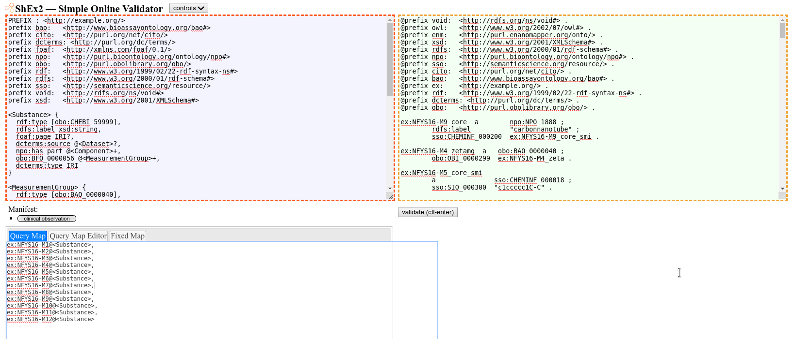

# ENMRDF Shape Expressions

This folder holds a formal schema that describes the data model to which the
RDF should comply. The shape expressions define that model and can be
serialized in the [W3C ShEX format](https://shex.io/).

The ShEX in the `enmrdf.shex` file can be used online with
[ShEx2, a Simple Online Validator](https://rawgit.com/shexSpec/shex.js/master/doc/shex-simple.html):

The purple area (left top) should hold the shape expressions,
the green area (top right) the data to be tested, and the
area below the purple area should contain a comma-separated
list of resources to be testsed and with which shape
expression.
